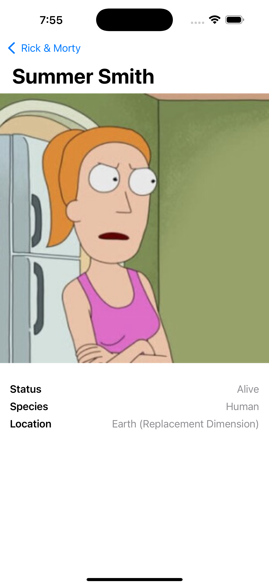

# Rick and Morty iOS App

A simple iOS application that showcases characters from the Rick and Morty universe.



## Features

- Browse Rick and Morty characters
- View detailed character information
- Clean and intuitive user interface
- SwiftUI implementation

## Requirements

- iOS 15.0+
- Xcode 14.0+
- Swift 5.0+

## Installation

1. Clone the repository
```bash
git clone https://github.com/ibvildthings/rick-and-morty-ios.git
```

2. Open the `.xcodeproj` file in Xcode

3. Build and run the project

## Technical Stack

- SwiftUI for UI
- Combine for data flow
- URLSession for networking
- Rick and Morty API for data

## Contributing

Feel free to submit issues and enhancement requests!

## License

This project is licensed under the MIT License - see the LICENSE file for details.

## Acknowledgments

- [Rick and Morty API](https://rickandmortyapi.com/) for providing the data
- Rick and Morty created by Justin Roiland and Dan Harmon
